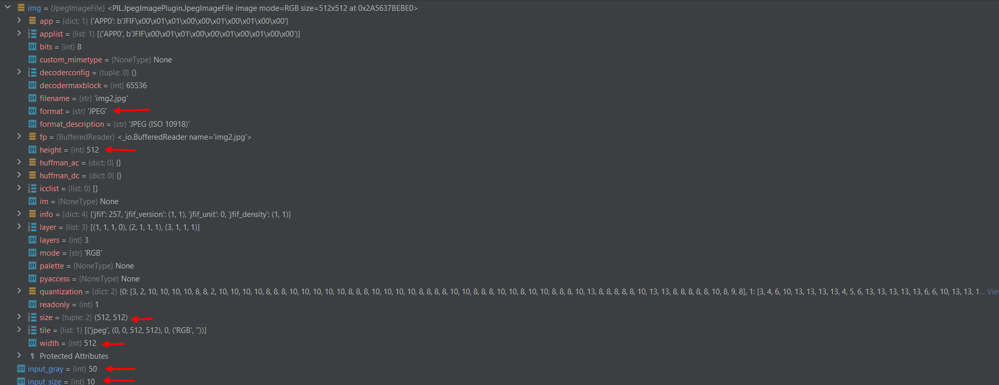

# PyCharmTrainAT06
# Сделано
1. Создан репозиторий на основании пред. проекта. Помещен filter.py и old_filter.py.
2. Создан новый проект, подключен репозиторий к IDE PyCharm. Загружены оба файла с помощью GIT в PyCharm к себе в проект на компьютер.
3. Добавлено тестовое изображение.
4. Добавил файл в репозиторий и отправил на сервер.
5. Запустил с помощью профилизатора новый filter.py. Сделал скриншот с временем выполнения.
  
6. Запустил с помощью профилизатора старый filter.py. Сделал скриншот с временем выполнения.
  
7. Создал копию фильтра - filter_with_filename.py. Добавил в репозиторий.
8. Запустил с помощью профилизатора filter_with_filename. Сделал скришнот с временем выполнения.
  
9. -
10. -
11. -
12. Проинспектировал проект. Исправил замечания по PEP8. Закниул в репозиторий
13. Через отладчик вывел на экран в свойстах изображения ширину и высоту, а также тип изображения. В отладчике вывел значения ширины блока и количество градаций серого.
14. Сделал скриншоты результата работы отладчика и отправил их в Readme 
  
